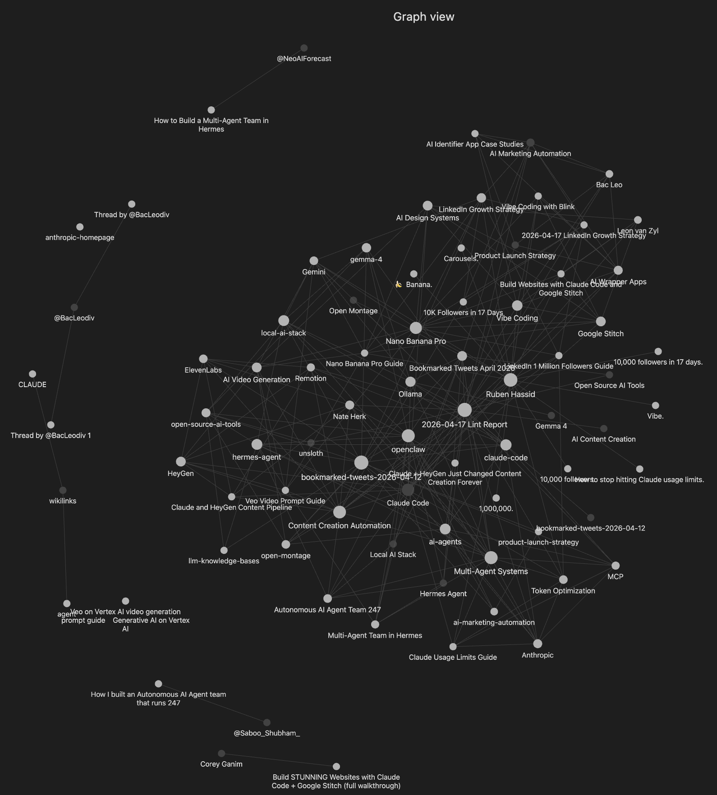

<div align="center">

# 🧠 AI-Powered Second Brain

### Clip anything. Wake up to a connected knowledge graph.

**An AI-Powered Second Brain built on Obsidian + Claude Code + free local AI (Ollama + Gemma 3).**
**You save articles. The AI organizes them into a searchable wiki while you sleep.**

> Inspired by [Andrej Karpathy's LLM-Wiki pattern](https://github.com/karpathy) — *"the LLM is the librarian, you're the curator."*

[](LICENSE)
[](https://ollama.com)
[](https://claude.ai/code)
[](https://obsidian.md)
[](#)
[](CONTRIBUTING.md)

[🚀 Quick Start](#-quick-start-30-seconds) • [📖 Full Setup](#-full-setup-detailed) • [💡 Use Cases](#-who-its-for) • [🐛 Troubleshooting](#-troubleshooting)

---



*Your knowledge graph after a single ingest session — 45 wiki entries, all auto-connected.*

</div>

---

## 📋 Table of Contents

- [What It Does](#-what-it-does)
- [Who It's For](#-who-its-for)
- [Quick Start](#-quick-start-30-seconds)
- [Prerequisites](#-prerequisites)
- [Full Setup](#-full-setup-detailed)
- [Usage](#-usage)
- [Configuration](#️-configuration)
- [Two-Speed Pipeline](#-two-speed-pipeline)
- [Proven Results](#-proven-results)
- [Repo Structure](#-repo-structure)
- [Troubleshooting](#-troubleshooting)
- [Roadmap](#️-roadmap)
- [Contributing](#-contributing)
- [Credits](#-credits)

---

## 🎯 What It Does

```
📎 Clip articles, drop PDFs, or save YouTube URLs
               ↓
📁 Lands in ~/SecondBrain/raw/  (.md, .pdf, or .txt with YouTube URL)
               ↓
⏰ Every 2 days at 4am  (automatic, macOS launchd)
               ↓
🤖 Local AI processes each clip  (Ollama + Gemma 3, completely free)
               ↓
🗂️  Wiki entries auto-created:
    wiki/entities/   → people, companies, tools
    wiki/concepts/   → ideas, frameworks, strategies
    wiki/sources/    → one summary per clip
    wiki/synthesis/  → cross-topic connections
               ↓
🔗 Everything linked with [[wikilinks]]
               ↓
🌐 Obsidian graph view renders your knowledge map
               ↓
💬 /second-brain-query answers questions with citations
```

**Zero cost for daily processing. Zero manual effort. If your Mac was asleep — it catches up automatically.**

### 📥 Supported Input Formats

Drop any of these in `~/SecondBrain/raw/` and the next ingest picks them up:

| Format | Example | How it's processed |
|---|---|---|
| **`.md`** | Web Clipper output, notes | Read as-is |
| **`.pdf`** | Papers, articles, resumes | Text extracted via [pypdf](https://github.com/py-pdf/pypdf) |
| **`.txt` (YouTube URL)** | `video.txt` with a YouTube URL on the first line | Transcript fetched via [youtube-transcript-api](https://github.com/jdepoix/youtube-transcript-api) |
| **`.txt` (plain text)** | Any text file | Read as-is |

Both libraries are fully open-source (MIT licensed).

---

## 👥 Who It's For

This tool is for anyone who reads a lot online and wants their notes to actually connect. Use cases:

- 🔬 **AI researchers** — clip papers and threads. Query: *"What have I saved about multi-agent systems?"*
- ✍️ **Content creators** — save viral posts and hooks. Query: *"What LinkedIn hooks have I collected?"*
- 💻 **Developers** — clip tutorials, docs, Stack Overflow. Query: *"How did I set up Ollama last time?"*
- 🎓 **Students** — save lecture notes and readings. Graph view shows how concepts link.
- 💼 **Entrepreneurs** — clip business case studies. Query: *"What SaaS strategies have I researched?"*
- 📈 **Investors** — track trends and news. Query: *"What have I saved about AI infrastructure?"*
- 🎯 **Job seekers** — clip advice, tips, company research. Build a map before interviews.
- 📝 **Writers** — save inspiration, quotes, research. Query: *"What do I know about persuasion?"*
- 🧠 **Anyone who reads a lot** — stop losing what you've read. Everything becomes searchable.

---

## 🔮 What is Obsidian?

[**Obsidian**](https://obsidian.md) is a free, local-first Markdown editor that turns your notes into a visual knowledge graph. Every time you write `[[Another Note]]` in a file, Obsidian creates a link between them — and the **Graph View** renders all those links as an interactive web of nodes.

That's why this project uses Obsidian: your Second Brain isn't just a folder of files, it's a **visual, explorable map** of everything you've learned. The screenshot at the top of this README is a real Obsidian Graph View from the first run of this system.

**Key things to know:**
- ✅ **Free** — no subscription required for local use
- ✅ **Your data stays on your Mac** — no cloud sync unless you opt in
- ✅ **Plain Markdown files** — works with any editor if you ever leave
- ✅ **Works offline** — everything runs locally

**👉 Download:** [https://obsidian.md](https://obsidian.md)

Available for macOS, Windows, Linux, iOS, and Android.

---

## 🤖 What Local LLM Does This Use?

This project uses **[Ollama](https://ollama.com)** to run open-source AI models locally on your Mac. **Zero cost, zero API keys, zero data sent to any cloud.** Everything stays on your machine.

**We tested and recommend these models:**

| Model | Size | Speed | Quality | Best for |
|---|---|---|---|---|
| **`gemma3:4b`** ✅ *default* | ~3GB | Fast (~30s per clip) | Good structured output | Daily clips, most users |
| `qwen3.5:4b` | ~3GB | Fast | Thinking model (uses `thinking` field) | Experimentation |
| `qwen3.5:9b` | ~7GB | Slower (~60s per clip) | Best quality, better connections | Power users with 16GB+ RAM |

**Why Gemma 3 as default?**
- Fast enough to process many clips in one overnight run
- Reliable at following structured output format (needed for wiki entries with `[[wikilinks]]`)
- Only 3GB — fits comfortably alongside your other apps
- Made by Google, actively maintained, fully open-source

**How much RAM does it use?**
- Gemma 3 4B → ~3-4GB while running
- Qwen 3.5 9B → ~7-8GB while running

Any M-series MacBook with 16GB+ RAM handles these comfortably.

```bash
# Install your preferred model
ollama pull gemma3:4b          # recommended
ollama pull qwen3.5:9b         # optional, better quality
```

Swap models anytime by editing one line in `auto_ingest.py`:
```python
MODEL = "gemma3:4b"    # or "qwen3.5:9b" or "qwen3.5:4b"
```

---

## ⚡ Quick Start (30 seconds)

**Requires:** macOS, [Obsidian](https://obsidian.md), [Ollama](https://ollama.com), [Claude Code](https://claude.ai/code)

```bash
git clone https://github.com/nitesht2/second-brain-ai
cd second-brain-ai
./setup.sh
ollama pull gemma3:4b
```

Then in Claude Code:
```
/second-brain
```

That's it. Install the [Web Clipper](https://obsidian.md/clipper), point it at the `raw` folder, and start clipping. The auto-ingest runs every 2 days at 4:07am automatically.

> 👉 **For the full guided walkthrough, see [Full Setup](#-full-setup-detailed) below.**

---

## 📦 Prerequisites

Install these four free tools before starting:

| Tool | What it is | Download |
|---|---|---|
| 🔮 **Obsidian** | Free Markdown editor with graph view — **this is where you'll see your knowledge map** | **[→ obsidian.md](https://obsidian.md)** |
| 🤖 **Ollama** | Runs AI models locally on your Mac (fully free, no API key) | **[→ ollama.com](https://ollama.com)** |
| ✨ **Claude Code** | Anthropic's AI assistant that powers the slash commands | **[→ claude.ai/code](https://claude.ai/code)** |
| 📎 **Obsidian Web Clipper** | Chrome/Firefox extension that saves webpages into your vault | **[→ obsidian.md/clipper](https://obsidian.md/clipper)** |

> **macOS required** for the auto-scheduler. Linux: use cron. Windows: see [Roadmap](#️-roadmap).

---

## 🚀 Full Setup (Detailed)

<details>
<summary><b>📘 Click to expand the full 9-step walkthrough (~15 min)</b></summary>

### Step 1 — Clone the repo

```bash
git clone https://github.com/nitesht2/second-brain-ai
cd second-brain-ai
```

### Step 2 — Create your vault

```bash
mkdir -p ~/SecondBrain/{raw/processed,wiki/{entities,concepts,sources,synthesis},outputs}
cp vault-template/CLAUDE.md ~/SecondBrain/
cp vault-template/wiki/index.md ~/SecondBrain/wiki/
cp vault-template/wiki/log.md ~/SecondBrain/wiki/
```

Structure created:
```
~/SecondBrain/
├── raw/              ← clips land here
│   └── processed/    ← moved after processing
├── wiki/
│   ├── entities/     ← people, companies, tools
│   ├── concepts/     ← ideas, frameworks
│   ├── sources/      ← clip summaries
│   ├── synthesis/    ← cross-topic insights
│   ├── index.md      ← master index
│   └── log.md        ← change log
├── outputs/          ← query/lint results
└── CLAUDE.md         ← vault rules for Claude
```

### Step 3 — Open in Obsidian

1. Open **Obsidian**
2. Click **"Open folder as vault"** → select `~/SecondBrain`
3. Click the **graph icon** in the sidebar → Graph View

### Step 4 — Configure Web Clipper

1. Install [Obsidian Web Clipper](https://obsidian.md/clipper) in Chrome
2. Extension settings → set **Note location** to `raw`
3. Name the template (e.g. "Brain Dump")
4. Test: clip any webpage → check `~/SecondBrain/raw/`

### Step 5 — Install Ollama + pull a model

```bash
ollama pull gemma3:4b        # recommended, ~3GB
ollama pull qwen3.5:9b       # optional, higher quality, ~7GB
```

### Step 6 — Install slash commands

```bash
cp claude-commands/*.md ~/.claude/commands/
```

### Step 7 — Set up auto-ingest

Install the two open-source libraries needed for PDF and YouTube support:

```bash
pip3 install --break-system-packages pypdf youtube-transcript-api
```

Then deploy the script and scheduler:

```bash
cp auto_ingest.py ~/SecondBrain/
python3 ~/SecondBrain/auto_ingest.py --dry-run
cp launchd/com.nitesh.secondbrain-ingest.plist ~/Library/LaunchAgents/
launchctl load ~/Library/LaunchAgents/com.nitesh.secondbrain-ingest.plist
launchctl list | grep secondbrain
```

Expected: `-  0  com.nitesh.secondbrain-ingest`

### Step 8 — Run the setup wizard

In Claude Code:
```
/second-brain
```

### Step 9 — Test the full pipeline

```bash
echo "# Gemma 3 by Google
Runs locally via Ollama for free." > ~/SecondBrain/raw/test-gemma.md

python3 ~/SecondBrain/auto_ingest.py
```

Open Obsidian — new nodes appear in the graph.

</details>

---

## 💬 Usage

Four slash commands in Claude Code:

| Command | What it does | Uses tokens? |
|---|---|:---:|
| `/second-brain` | Setup wizard — checks your configuration | No |
| `/second-brain-ingest` | Process raw clips with Claude Sonnet (best quality) | Yes |
| `/second-brain-query [question]` | Ask questions, get cited answers from your wiki | Yes |
| `/second-brain-lint` | Health check: broken links, orphans, stubs, gaps | Yes |

**Plus the free local script:**

```bash
python3 ~/SecondBrain/auto_ingest.py           # run manually
python3 ~/SecondBrain/auto_ingest.py --dry-run # preview only
```

The local script runs automatically every 2 days — you rarely need to run it by hand.

---

## ⚙️ Configuration

Edit the top of `auto_ingest.py`:

```python
MODEL      = "gemma3:4b"   # or "qwen3.5:9b" for higher quality
MIN_HOURS  = 48            # 48 = every 2 days, 24 = daily
MAX_TOKENS = 3000          # max tokens per model call
RAW_CHUNK  = 3500          # chars per clip sent to model
```

<details>
<summary><b>Change the run time</b></summary>

```bash
nano ~/Library/LaunchAgents/com.nitesh.secondbrain-ingest.plist
# Change <integer>4</integer> (Hour) to your preferred hour

launchctl unload ~/Library/LaunchAgents/com.nitesh.secondbrain-ingest.plist
launchctl load ~/Library/LaunchAgents/com.nitesh.secondbrain-ingest.plist
```

</details>

---

## 🔄 Two-Speed Pipeline

| | 🤖 Auto (Local AI) | ✨ Manual (Claude Sonnet) |
|---|---|---|
| **Trigger** | Every 2 days at 4am | You type `/second-brain-ingest` |
| **Cost** | Free | Claude Code tokens |
| **Quality** | Good | Excellent |
| **Speed** | ~30-60s per clip | ~10-20s per clip |
| **Best for** | Daily clips, bookmarks | Key research, deep articles |

**Recommended:** Let local AI handle the daily drip. Run Claude for anything that truly matters.

---

## 🔥 Proven Results

> First real run on a personal vault: **16 files ingested → 45 wiki entries created → 15 broken links detected → 14 auto-fixed in 5 minutes.**
>
> Zero tokens spent on the daily pipeline. Everything searchable in Obsidian graph view.

<details>
<summary><b>Full session breakdown</b></summary>

- **Phase 1:** Migrated 11 old clips from a wrong vault into the correct structure
- **Phase 2:** Ran `/second-brain-ingest` on 16 files → 45 wiki entries created
- **Phase 3:** Asked `/second-brain-query "LinkedIn growth strategy"` → cited answer saved to outputs/
- **Phase 4:** Ran `/second-brain-lint` → found 15 broken links, 1 stub → fixed to 1 broken (intentionally deferred)
- **Phase 5:** Built `auto_ingest.py` + macOS launchd plist for fully automated, free, local daily processing

</details>

---

## 📁 Repo Structure

```
second-brain-ai/
├── README.md                                     ← you are here
├── setup.sh                                      ← one-command installer (runs all setup steps)
├── auto_ingest.py                                ← local AI ingest script (Ollama + Gemma 3)
├── CONTRIBUTING.md                               ← how to contribute
├── LICENSE                                       ← MIT
├── .gitignore
│
├── claude-commands/                              ← copy these to ~/.claude/commands/
│   ├── second-brain.md                           ← /second-brain (setup wizard)
│   ├── second-brain-ingest.md                    ← /second-brain-ingest (Claude Sonnet quality)
│   ├── second-brain-query.md                     ← /second-brain-query (ask questions)
│   └── second-brain-lint.md                      ← /second-brain-lint (health check)
│
├── launchd/                                      ← macOS auto-scheduler
│   └── com.nitesh.secondbrain-ingest.plist       ← runs every 2 days at 4:07am
│
├── docs/
│   └── screenshots/
│       ├── README.md                             ← guide for adding screenshots
│       └── graph-view.png                        ← hero image (Obsidian Graph View)
│
└── vault-template/                               ← copy everything inside into ~/SecondBrain/
    ├── CLAUDE.md                                 ← vault instructions for Claude
    ├── wiki/
    │   ├── index.md                              ← master index of entries
    │   ├── log.md                                ← ingest change log
    │   ├── entities/                             ← people, companies, tools
    │   │   └── .gitkeep
    │   ├── concepts/                             ← ideas, frameworks, strategies
    │   │   └── .gitkeep
    │   ├── sources/                              ← one summary per clip
    │   │   └── .gitkeep
    │   └── synthesis/                            ← cross-topic insights
    │       └── .gitkeep
    ├── raw/                                      ← clips land here
    │   ├── .gitkeep
    │   └── processed/                            ← moved here after processing
    │       └── .gitkeep
    └── outputs/                                  ← query results and lint reports
        └── .gitkeep
```

---

## 🐛 Troubleshooting

<details>
<summary><b>"Ollama not reachable"</b></summary>

Open the Ollama app (check menu bar) or run `ollama serve` in terminal.
</details>

<details>
<summary><b>launchd job not firing</b></summary>

```bash
launchctl list | grep secondbrain                 # check loaded
cat ~/SecondBrain/outputs/ingest-daemon.log       # read errors
```
</details>

<details>
<summary><b>Web Clipper saving to wrong folder</b></summary>

Extension settings → set **Note location** to `raw` (not `Clippings`).
</details>

<details>
<summary><b>qwen3.5 returns empty response field</b></summary>

Expected — qwen3 is a thinking model. The script auto-reads the `thinking` field. No action needed.
</details>

<details>
<summary><b>Wiki entries have underscores in filenames</b></summary>

Local 4B models sometimes use underscores. Rename in Obsidian or use `/second-brain-ingest` with Claude.
</details>

<details>
<summary><b>Mac was fully shut down (not sleeping)</b></summary>

launchd only catches up from sleep. A full shutdown misses the run. It fires again at the next scheduled time.
</details>

<details>
<summary><b>PDF extraction fails or returns garbage text</b></summary>

`pypdf` works great on digital PDFs but struggles with scanned (image-only) PDFs. Fallback options:

| Method | Install | When to use |
|---|---|---|
| **pdftotext** (poppler) | `brew install poppler` | More accurate on complex layouts |
| **pdfplumber** | `pip3 install pdfplumber` | Better at tables |
| **Tesseract OCR** | `brew install tesseract` | Scanned/image-only PDFs |

Swap it in `auto_ingest.py` inside `extract_pdf_text()`. Or convert the PDF to markdown manually with any tool and drop the `.md` file in `raw/`.
</details>

<details>
<summary><b>YouTube transcript fetch fails</b></summary>

YouTube occasionally blocks the scraping endpoint `youtube-transcript-api` uses, or the video has no captions. Fallback options:

| Method | Install | Notes |
|---|---|---|
| **yt-dlp** | `brew install yt-dlp` | Run `yt-dlp --write-auto-sub --skip-download URL` — saves `.vtt` file |
| **OpenAI Whisper (local)** | `pip3 install openai-whisper` | Transcribes any video locally, free, ~1GB model |
| **Manual paste** | None | Copy the transcript from YouTube's UI, paste into a `.md` file |

The simplest fallback: copy the transcript manually from YouTube's "Show transcript" button and save it as a `.md` file in `raw/`.
</details>

<details>
<summary><b>PDF or YouTube libraries not installed</b></summary>

```bash
pip3 install --break-system-packages pypdf youtube-transcript-api
```

The script will tell you exactly which one is missing in its error output.
</details>

---

## 🗺️ Roadmap

- [ ] Windows support (Task Scheduler)
- [ ] Linux cron setup guide
- [ ] Auto-update `wiki/index.md` after every ingest
- [ ] `wiki/synthesis/` auto-generation
- [x] PDF + YouTube transcript ingestion ✅
- [ ] Discord/Slack notification on ingest completion
- [ ] Web dashboard to browse vault without Obsidian

---

## 🤝 Contributing

Contributions welcome! See [CONTRIBUTING.md](CONTRIBUTING.md).

Windows/Linux support, better local model prompts, and new ingest sources especially appreciated.

---

## 🙏 Credits

Built by [@NiteshTechAI](https://x.com/NiteshTechAI)

**Inspired by:**
- [NicholasSpisak/second-brain](https://github.com/NicholasSpisak/second-brain) — original system and slash commands
- [swyx/brain](https://github.com/swyxio/brain) — public Obsidian vault
- [Andrej Karpathy](https://x.com/karpathy) — LLM-Wiki pattern
- [Ruben Hassid](https://ruben.substack.com) — AI productivity workflows

**Powered by these open-source projects:**
- [Ollama](https://github.com/ollama/ollama) — local LLM runtime (MIT)
- [Gemma 3](https://huggingface.co/google/gemma-3-4b-it) — Google's open model family
- [Qwen 3.5](https://github.com/QwenLM/Qwen) — Alibaba's open model family
- [pypdf](https://github.com/py-pdf/pypdf) — PDF text extraction (MIT)
- [youtube-transcript-api](https://github.com/jdepoix/youtube-transcript-api) — YouTube transcript fetching (MIT)
- [Obsidian](https://obsidian.md) — local-first Markdown editor

---

## 📄 License

MIT — free to use, modify, and share.

If you build something cool, tag [@NiteshTechAI](https://x.com/NiteshTechAI) on X. 🚀

---

<div align="center">

**⭐ Star this repo** if it helps you organize your knowledge.

</div>
